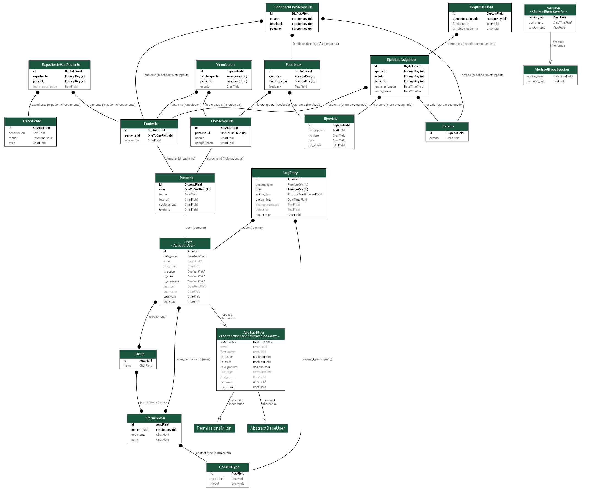

# Requerimientos
- Docker >= 27.3.1
- Docker Compose >= 2.29.7
- Python >= 3.13.0
- IntelliJ IDEA >= 2020.2.0.2 (Recomendado)
- Postman (Recomendado)

# Desarrollo

El desarrollo se basa en una API REST la cual es una interfaz de programación de aplicaciones (API) 
que utiliza un estilo arquitectónico de transferencia de estado representacional (REST). 
El estilo arquitectónico REST utiliza HTTP para solicitar acceso y utilizar datos. Esto permite la interacción con servicios web RESTful.

## Instalación
- Instalar la imagen de la API y de la DB `docker-compose build`
- (Opcional) Configurar el interprete de python del contenedor de docker. Usando IntelliJ:
  - Abre las configuraciones del proyecto: `File` → `Settings`.
  - Ve a la sección de intérpretes de Python: `Project: tt_backend` → `Python Interpreter`.
  - Selecciona el intérprete del contenedor de Docker: `Add Interpreter` → `On Docker Compose` → `Service` → `djangoapp`.

## Ejecutar Servidor
- Ejecutar `docker-compose up -d`

## Ejecutar Migraciones
- Reinicia el contenedor con el comando `docker-compose up -d`

## Diagrama ilustrativo

## Diagrama de los Modelos

## Documentación de los endpoints
https://docs.google.com/document/d/1flyScEiDVKqQVDUTy_64g_H_2hWeATuMSoyoXtfLVOU/edit?usp=sharing
